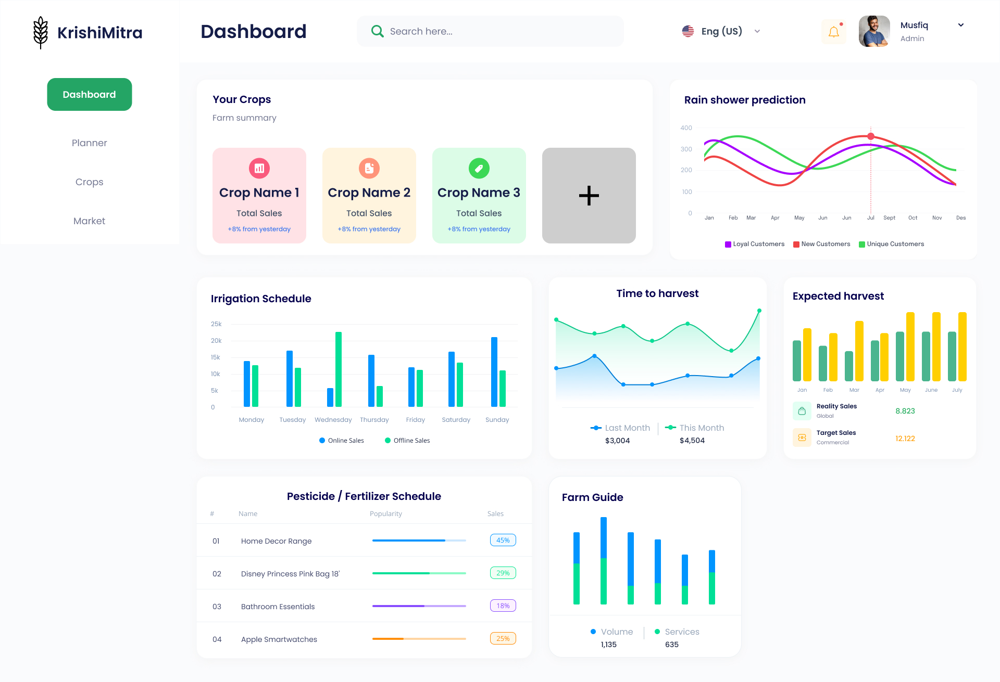
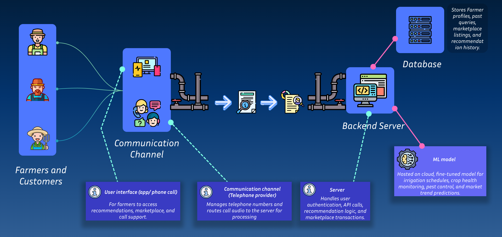

<a id="readme-top"></a>
[![Contributors][contributors-shield]][contributors-url]
[![Forks][forks-shield]][forks-url]
[![Stargazers][stars-shield]][stars-url]
[![Issues][issues-shield]][issues-url]
[![MIT License][license-shield]][license-url]
<!-- PROJECT LOGO -->
<br />
<div align="center">
    

  <h1 align="center">KrishiMitra</h1>

  <p align="center">
    Just a great tool to empower farmers
    <br />
    <br />
    <strong>GG_Coders</strong>
    <br />
    <strong>FantomCode2025 4th edition</strong>
    <br />
    <strong>11/04/2025</strong>
  </p>
</div>

## 📖 Table of Contents

1. [Introduction](#-introduction)
2. [Problem Statement](#-problem-statement)
3. [Solution Overview](#-solution-overview)
4. [Tech Stack](#-tech-stack)
5. [Architecture / Diagram (if any)](#-architecture--diagram-if-any)
6. [Installation & Usage](#-installation--usage)
   - [Steps to run frontend](#steps-to-run-frontend)
   - [Steps to run backend](#steps-to-run-backend)
   - [Steps to run ml model](#steps-to-run-ml-model)
7. [Team Members](#team-members)

## 🧠 Introduction

This project is a unified agri-support platform tailored for smallholder farmers, especially those with limited digital access. It enables farmers to receive crop-related insights, weather-based farming tips, irrigation and pesticide schedules, and direct access to a crop marketplace—either via a mobile app or an automated phone call service.

By making farming data and expert advice accessible to all, we aim to bridge the digital divide in agriculture and increase profitability for underserved rural communities.

## ❗ Problem Statement

Smallholder farmers in rural areas face multiple challenges:

- Lack of personalized crop advice and scientific farming knowledge.

- Dependence on middlemen, leading to reduced profits.

- No digital access or technical literacy, excluding them from agri-tech advancements.

- Ineligibility for credit, due to lack of formal transaction records or farm documentation.

These issues result in poor yields, financial instability, and minimal growth, keeping farmers locked in a cycle of low income and inefficiency.

## ✅ Solution Overview

Our platform provides a dual-access solution for farmers—via an Android app and a phone-based voice interface. Key features include:

- 📲 Farmer Registration: Captures key details like location, crops, and land size to tailor recommendations.

- 🌱 Crop & Process Recommendations: Uses ML to suggest best-fit crops and ideal sowing practices.

- 💧 Irrigation and Pesticide Scheduling: Offers dynamic alerts based on crop type, weather, and location.

- 🛒 Inbuilt Marketplace: Enables direct crop sales, bypassing middlemen.

- ☎ Phone Service for Non-Smartphone Users: Ensures inclusivity for digitally disconnected farmers.

- 📈 Data Generation for Credit Access: Transaction and farming data helps farmers build a credit profile for future financial inclusion.

Below is a screenshot of the dashboard interface design (implementation may differ):



This solution brings accessibility, empowerment, and profitability directly into the hands of farmers.

## 🛠️ Tech Stack

[![twilio][twilio]][twilio-url]
[![React][React.js]][React-url]
[![TailwindCSS][Tailwind]][tailwind-url]
[![Node.js][Nodejs]][Nodejs-url]
[![Express.js][Express.js]][express-url]
[![MongoDB][MongoDB]][mongodb-url]
[![Ngrok][Ngrok]][Ngrok-url]
[![Npm][Npm]][Npm-url]
[![python][python]][python-url]
[![scikit][scikit]][scikit-url]
[![numpy][numpy]][numpy-url]
[![pandas][pandas]][pandas-url]
[![fastapi][fastapi]][fastapi-url]

## 🧩 Architecture Diagram



## 🧪 Installation & Usage

### Prerequisites

- Node.js >= 20
- Python >= 3.12
- Ngrok

### Steps

Firstly, set up the following enviorment variables and store it in a `.env` in backend folder (one will have to set up a `twilio` account first)

```bash
MONGO_URI
JWT_SECRET_KEY
GEMINI_API_KEY
TWILIO_ACCOUNT_SID
TWILIO_AUTH_TOKEN
TWILIO_PHONE
ACCUWEATHER_API_KEY
```

```bash
# Clone the repository
git clone https://github.com/FantomCode25/GG_Coders.git

# Navigate into the project directory
cd GG_Coders
```

### Steps to run frontend

```bash
# Navigate to frontend
cd frontend

# Install npm packages
npm install

# Run the website
npm run dev
```

### Steps to run backend

<!-- need to add -->

```bash
# Navigate to backend
cd backend

# Install packages
npm install

# Start server
node server.js
```

### Steps to run ml-model

Here one must ensure of that the datasets

- `datasets/crop-predictor-with-fertilising-days.csv`
- `datasets/vegetable-prices.csv`

The columns respectively are:

<!-- Need to change -->

- `datesk,Item Name,Date,price` (`dataesk` is just Date but a number)
- `Temparature,Humidity,Moisture,Soil Type,Crop Type,Nitrogen,Potassium,Phosphorous,Fertilizer Name,fertilise_once_in_days`

```bash
# Navigate to ml-model
cd ml-model

# Install Python packages
python -m env .venv
source .venv/bin/activate # on linux
.venv\Scripts\activat # on windows
pip install -r requirements.txt

# Run the ML model
uvicorn main:app --reload --host 0.0.0.0 --port 8000
```

To share your API over the internet we will make use of ngrok, run the following on a separate terminal. Use the link given by the below commands for your API calls.

```bash
# This just makes your local domain a public domain
ngork http 8000
```

#### Steps to make API call to access ML model

With the link obtained from `ngrok` use one can use the following `POST` request

- /predict-price
- /predict-crop-fertilizer
- /recommend-fertilizer

Each of them has the following attributes

```json
predict-price
{
  "item_name": "string",
  "date": "string"
}
```

```json
predict-crop-fertilizer
{
  "Temparature": 0,
  "Humidity": 0,
  "Moisture": 0,
  "Soil_Type": "string",
  "Nitrogen": 0,
  "Potassium": 0,
  "Phosphorous": 0
}
```

```json
recommend-fertilizer
{
  "Temparature": 0,
  "Humidity": 0,
  "Moisture": 0,
  "Soil_Type": "string",
  "Nitrogen": 0,
  "Potassium": 0,
  "Phosphorous": 0,
  "crop_name": "string"
}
```

One can learn more about this from the `/docs` page.

## Team Members

<!-- add conetnt boy -->

<p align="right">(<a href="#readme-top">back to top</a>)</p>

<!-- MARKDOWN LINKS & IMAGES -->
<!-- https://www.markdownguide.org/basic-syntax/#reference-style-links -->

[twilio]: https://img.shields.io/badge/Twilio-F22F46?style=for-the-badge&logo=Twilio&logoColor=white
[twilio-url]: https://www.twilio.com/en-us
[React.js]: https://img.shields.io/badge/React-20232A?style=for-the-badge&logo=react&logoColor=61DAFB
[React-url]: https://reactjs.org/
[Tailwind]: https://img.shields.io/badge/Tailwind_CSS-38B2AC?style=for-the-badge&logo=tailwind-css&logoColor=white
[Tailwind-url]: https://tailwindcss.com/
[Nodejs]: https://img.shields.io/badge/Node.js-5FA04E?logo=nodedotjs&logoColor=fff&style=for-the-badge
[Nodejs-url]: https://nodejs.org/en
[Express.js]: https://img.shields.io/badge/Express%20js-000000?style=for-the-badge&logo=express&logoColor=white
[Express-url]: https://expressjs.com/
[MongoDB]: https://img.shields.io/badge/MongoDB-4EA94B?style=for-the-badge&logo=mongodb&logoColor=white
[MongoDB-url]: https://www.mongodb.com/
[Ngrok]: https://img.shields.io/badge/ngrok-140648?style=for-the-badge&logo=Ngrok&logoColor=white
[Ngrok-url]: https://ngrok.com/
[Npm]: https://img.shields.io/badge/npm-CB3837?style=for-the-badge&logo=npm&logoColor=whit
[Npm-url]: https://www.npmjs.com/
[python]: https://img.shields.io/badge/Python-FFD43B?style=for-the-badge&logo=python&logoColor=blue
[python-url]: https://python.org
[scikit]: https://img.shields.io/badge/scikit_learn-F7931E?style=for-the-badge&logo=scikit-learn&logoColor=white
[scikit-url]: https://scikit-learn.org/stable/
[numpy]: https://img.shields.io/badge/Numpy-777BB4?style=for-the-badge&logo=numpy&logoColor=whit
[numpy-url]: https://numpy.org/
[pandas]: https://img.shields.io/badge/Pandas-2C2D72?style=for-the-badge&logo=pandas&logoColor=white
[pandas-url]: https://pandas.pydata.org/
[fastapi]: https://img.shields.io/badge/fastapi-109989?style=for-the-badge&logo=FASTAPI&logoColor=white
[fastapi-url]: https://fastapi.tiangolo.com/
[contributors-shield]: https://img.shields.io/github/contributors/FantomCode2025/GG_Coders?style=for-the-badge
[contributors-url]: https://github.com/FantomCode2025/GG_Coders/graphs/contributors
[forks-shield]: https://img.shields.io/github/forks/FantomCode2025/GG_Coders.svg?style=for-the-badge
[forks-url]: https://github.com/FantomCode2025/GG_Coders/network/members
[stars-shield]: https://img.shields.io/github/stars/FantomCode2025/GG_Coders.svg?style=for-the-badge
[stars-url]: https://github.com/FantomCode2025/GG_Coders/stargazers
[issues-shield]: https://img.shields.io/github/issues/FantomCode2025/GG_Coders.svg?style=for-the-badge
[issues-url]: https://github.com/FantomCode2025/GG_Coders/issues
[license-shield]: https://img.shields.io/github/license/FantomCode2025/GG_Coders.svg?style=for-the-badge
[license-url]: https://github.com//FantomCode2025/blob/master/LICENSE.txt